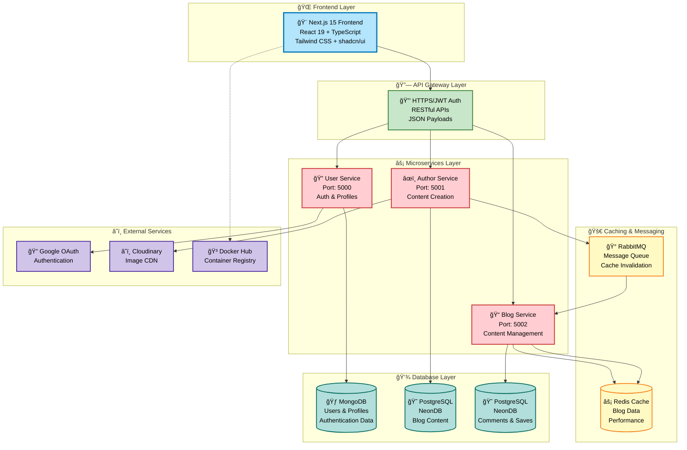
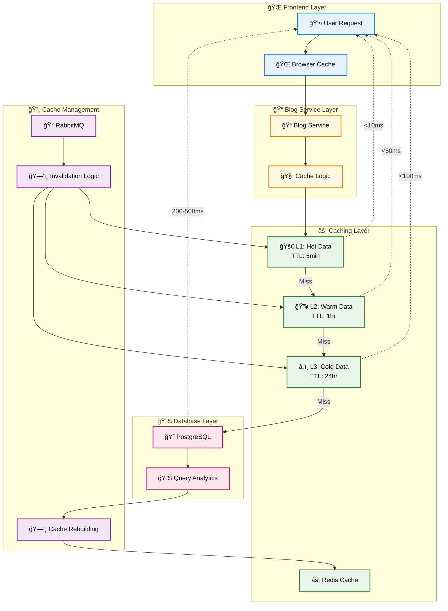

# The Reading Retreat - Frontend

A modern, responsive blog application frontend built with Next.js 15, React 19, and Tailwind CSS. This is the frontend component of the BlogApp Microservices architecture, designed to provide a seamless reading and blogging experience.

## 🚀 Features

<div align="center">

### ✨ Key Capabilities

</div>

### 🎨 **Modern UI/UX**
- **shadcn/ui** components for consistent design language
- **Tailwind CSS** utility-first design system
- **Responsive** layouts that adapt to any screen size
- **Clean** & **professional** user interface design
- **Accessibility-first** component architecture

### 📱 **Responsive Design**
- **Mobile-first** approach for optimal performance
- **Hamburger menu** navigation for mobile devices
- **Adaptive** layouts that scale beautifully
- **Cross-device** compatibility across all platforms
- **Touch-friendly** interface elements

### 🔐 **Multi-Authentication**
- **Google OAuth 2.0** social login integration
- **Email/Password** traditional authentication
- **JWT** secure token-based authorization
- **Token** automatic refresh mechanism
- **Session** management with secure storage

### ⚡ **Developer Experience**
- **Full TypeScript** support for type safety
- **Component library** system with shadcn/ui
- **Microservices** seamless backend integration
- **Modern tooling** & **best practices**
- **Hot reload** development environment

<div align="center">

### 🏗️ **Architecture Highlights**
[](https://nextjs.org/)
[](https://reactjs.org/)
[](https://www.typescriptlang.org/)
[](https://tailwindcss.com/)

</div>

## 🏗️ Architecture Overview

<div align="center">

### 🌟 High-Level System Architecture



</div>

## 🔧 Technical Implementation Details

### 🔌 **API Integration Patterns**
```typescript
// Authentication Header Pattern
const apiCall = async (endpoint: string, options: RequestInit = {}) => {
  const token = localStorage.getItem('jwt_token');
  
  return fetch(`${API_BASE_URL}${endpoint}`, {
    ...options,
    headers: {
      'Authorization': `Bearer ${token}`,
      'Content-Type': 'application/json',
      ...options.headers,
    },
  });
};

// Service Endpoints
const SERVICES = {
  USER: 'http://localhost:5000/api/v1',
  AUTHOR: 'http://localhost:5001/api/v1', 
  BLOG: 'http://localhost:5002/api/v1'
};
```

### 🔄 **State Management Flow**
```
User Action (UI Event)
    │
    ▼
React Component State Update
    │
    ▼
API Call to Microservice
    │
    ▼
Backend Processing
    │
    ▼
Response with Updated Data
    │
    ▼
Component Re-render
    │
    ▼
UI Update
```

### ⚡ Advanced Caching Strategy


---

## 🛠️ Tech Stack

<div align="center">

### 🎯 Technology Overview

</div>

### 🚀 **Frontend Framework**
- **Next.js 15.x** - React framework with Server-Side Rendering and App Router
- **React 19.x** - Modern UI library with latest concurrent features
- **TypeScript 5.x** - Enhanced type safety and developer experience
- **App Router** - File-based routing with nested layouts and streaming

### 🎨 **Styling & UI**
- **[Tailwind CSS 4](https://tailwindcss.com/)** - Utility-first CSS framework for rapid styling
- **[shadcn/ui](https://ui.shadcn.com/)** - Modern, accessible React component library
- **[Radix UI](https://www.radix-ui.com/)** - Unstyled, accessible UI primitives
- **[Lucide React](https://lucide.dev/)** - Beautiful, customizable SVG icon library
- **CSS Variables** - Dynamic theming with custom properties

### 🔐 **Authentication & Security**
- **Google OAuth 2.0** - Secure social authentication integration
- **JWT (JSON Web Tokens)** - Stateless, secure authorization mechanism
- **HTTP-only Cookies** - XSS protection for sensitive data storage
- **Multi-factor Authentication** - Email/password + social login options
- **Token Auto-refresh** - Seamless session management

### 🔧 **Development Tools**
- **`clsx` + `tailwind-merge`** - Intelligent CSS class management
- **`class-variance-authority`** - Type-safe component variant system
- **ESLint** - Code quality and consistency enforcement
- **PostCSS** - Advanced CSS processing and optimization
- **Full TypeScript Support** - Enhanced IntelliSense and error catching

### 🔗 **Backend Integration**
- **RESTful APIs** - Clean, consistent API communication patterns
- **[User Service](https://github.com/sajjad6ansari/BlogApp-UserService)** - Authentication and user management
- **[Author Service](https://github.com/sajjad6ansari/BlogApp-AuthorService)** - Content creation and author operations  
- **[Blog Service](https://github.com/sajjad6ansari/BlogApp-BlogService)** - Blog content storage and retrieval

## 📁 Complete Project Structure

This project is part of a comprehensive microservices architecture. Below is the complete structure including all services:

### 🌐 **Frontend Application (This Repository)**
```
frontend/
├── src/
│   ├── app/                    # Next.js App Router
│   │   ├── favicon.ico        # App favicon
│   │   ├── globals.css        # Global styles and CSS variables
│   │   ├── layout.tsx         # Root layout component
│   │   ├── page.tsx          # Home page
│   │   ├── blog/
│   │   │   ├── [id]/
│   │   │   │   └── page.tsx  # Blog detail page
│   │   │   ├── edit/
│   │   │   │   └── [id]/
│   │   │   │       └── page.tsx  # Edit blog page
│   │   │   ├── new/
│   │   │   │   └── page.tsx  # Create new blog page
│   │   │   └── saved/
│   │   │       └── page.tsx  # Saved blogs page
│   │   ├── blogs/
│   │   │   ├── layout.tsx    # Blogs layout
│   │   │   └── page.tsx      # All blogs page
│   │   ├── login/
│   │   │   └── page.tsx      # Login page
│   │   ├── register/
│   │   │   └── page.tsx      # Registration page
│   │   └── profile/
│   │       ├── page.tsx      # User profile page
│   │       └── [id]/
│   │           └── page.tsx  # Other user's profile
│   ├── components/
│   │   ├── BlogCard.tsx      # Blog card component
│   │   ├── loading.tsx       # Loading component
│   │   ├── navbar.tsx        # Navigation component
│   │   ├── sidebar.tsx       # Sidebar component
│   │   └── ui/               # Reusable UI components
│   │       ├── avatar.tsx    # Avatar component
│   │       ├── button.tsx    # Button component with variants
│   │       ├── card.tsx      # Card component
│   │       ├── dialog.tsx    # Dialog component
│   │       ├── input.tsx     # Input component
│   │       └── ...           # Other shadcn/ui components
│   ├── context/
│   │   └── AppContext.tsx    # Global application context
│   ├── hooks/
│   │   └── use-mobile.ts     # Mobile detection hook
│   └── lib/
│       └── utils.ts          # Utility functions
├── public/                   # Static assets
├── components.json           # shadcn/ui configuration
├── next.config.ts           # Next.js configuration
├── package.json             # Dependencies and scripts
├── tailwind.config.js       # Tailwind CSS configuration
└── tsconfig.json            # TypeScript configuration
```

### 🔐 **User Service** - [📖 Detailed Documentation](https://github.com/sajjad6ansari/BlogApp-UserService)
*Authentication, user management, and profile operations*
```
user-service/
├── src/
│   ├── controllers/
│   │   └── user.ts          # User management logic
│   │   └── auth/
│   │       └── auth.ts      # Authentication controllers
│   ├── middleware/
│   │   ├── isAuth.ts        # JWT authentication middleware
│   │   └── multer.ts        # File upload middleware
│   ├── model/
│   │   └── User.ts          # User data model (MongoDB)
│   ├── routes/
│   │   └── user.ts          # User API routes
│   ├── utils/
│   │   ├── dataUri.ts       # Data URI utilities
│   │   ├── db.ts            # Database connection
│   │   ├── GoogleConfig.ts  # Google OAuth configuration
│   │   └── TryCatch.ts      # Error handling wrapper
│   └── server.ts            # Express server setup
├── Dockerfile               # Container configuration
├── package.json             # Dependencies
└── tsconfig.json            # TypeScript config
```

### ✍️ **Author Service** - [📖 Detailed Documentation](https://github.com/sajjad6ansari/BlogApp-AuthorService)
*Content creation, blog authoring, and media management*
```
author-service/
├── src/
│   ├── controllers/
│   │   └── blog.ts          # Blog creation and management
│   ├── middlewares/
│   │   ├── isAuth.ts        # JWT verification
│   │   └── multer.ts        # Image upload handling
│   ├── routes/
│   │   └── blog.ts          # Author-specific blog routes
│   ├── utils/
│   │   ├── dataUri.ts       # Image processing utilities
│   │   ├── db.ts            # PostgreSQL connection
│   │   ├── rabbitmq.ts      # Message queue integration
│   │   └── TryCatch.ts      # Error handling
│   └── server.ts            # Express server
├── Dockerfile               # Docker configuration
├── package.json             # Dependencies
└── tsconfig.json            # TypeScript config
```

### 📝 **Blog Service** - [📖 Detailed Documentation](https://github.com/sajjad6ansari/BlogApp-BlogService)
*Blog consumption, caching, comments, and content delivery*
```
blog-service/
├── src/
│   ├── controllers/
│   │   └── blog.ts          # Blog retrieval and management
│   ├── middleware/
│   │   └── isAuth.ts        # Authentication middleware
│   ├── routes/
│   │   └── blog.ts          # Blog consumption routes
│   ├── utils/
│   │   ├── consumer.ts      # RabbitMQ message consumer
│   │   ├── db.ts            # PostgreSQL connection
│   │   └── TryCatch.ts      # Error handling utilities
│   └── server.ts            # Express server setup
├── Dockerfile               # Container configuration
├── package.json             # Dependencies
└── tsconfig.json            # TypeScript config
```

### 🗂️ **Microservices Communication**
Each service operates independently with the following integration points:

- **🔗 API Endpoints**: RESTful APIs on different ports (5000, 5001, 5002)
- **🔐 Authentication**: Shared JWT token validation across services
- **📡 Messaging**: RabbitMQ for inter-service communication and cache invalidation
- **💾 Databases**: MongoDB (User Service) + PostgreSQL (Author/Blog Services)
- **⚡ Caching**: Redis integration in Blog Service for performance optimization

> **📚 For comprehensive implementation details, setup instructions, and API documentation, please refer to each service's dedicated repository linked above.**

## 🚀 Getting Started

### 📋 **Prerequisites**

- **Node.js 18+** - JavaScript runtime environment
- **Package Manager** - npm, yarn, pnpm, or bun

### 📦 **Installation**

1. **Clone the repository**
   ```bash
   git clone <repository-url>
   cd BlogApp_Microservices/frontend
   ```

2. **Install dependencies**
   ```bash
   npm install
   # or
   yarn install
   # or
   pnmp install
   # or
   bun install
   ```

3. **Run the development server**
   ```bash
   npm run dev
   # or
   yarn dev
   # or
   pnpm dev
   # or
   bun dev
   ```

4. **Open your browser**
   Navigate to [http://localhost:3000](http://localhost:3000) to see the application.

## 📜 Available Scripts

- `npm run dev` - Start development server
- `npm run build` - Build the application for production
- `npm run start` - Start the production server
- `npm run lint` - Run ESLint for code linting

## 🎨 UI Components

The project uses shadcn/ui components with the "new-york" style configuration:

- **Button**: Multiple variants (default, destructive, outline, secondary, ghost, link)
- **Card**: Flexible card components with header, content, and footer sections
- **Navigation**: Responsive navbar with mobile menu support

### ⚙️ **Component Configuration**

The UI components are configured via `components.json`:
- **Style**: new-york
- **Base Color**: slate
- **CSS Variables**: Enabled
- **Icon Library**: lucide
- **RSC**: React Server Components enabled

## 🎯 Key Features

### 🧭 **Navigation**
- **Brand**: "The Reading Retreat"
- **Menu Items**: 
  - Home
  - Saved Blogs (authentication-dependent)
  - Login/Profile (context-dependent)
- **Mobile Responsive**: Collapsible hamburger menu
- **Icons**: Lucide icons for visual clarity

### 🎨 **Theming**
- **CSS Variables**: Custom properties for consistent theming
- **Dark Mode Ready**: Theme configuration supports dark mode
- **Custom Colors**: Comprehensive color palette with semantic naming
- **Radius Variables**: Consistent border radius across components

## 🔗 Microservices Integration

This frontend is fully integrated with the following backend microservices:

### 🔐 User Service
- **Repository**: [BlogApp-UserService](https://github.com/sajjad6ansari/BlogApp-UserService)
- **Features**: 
  - User registration and profile management
  - Password-based authentication
  - Google OAuth integration
  - JWT token generation and validation

### ✍️ Author Service  
- **Repository**: [BlogApp-AuthorService](https://github.com/sajjad6ansari/BlogApp-AuthorService)
- **Features**:
  - Author profile management
  - Author-specific blog operations
  - Content creation and editing capabilities

### 📝 Blog Service
- **Repository**: [BlogApp-BlogService](https://github.com/sajjad6ansari/BlogApp-BlogService) 
- **Features**:
  - Blog post management (CRUD operations)
  - Blog content storage and retrieval
  - Blog categorization and tagging

### 🔑 Authentication & Authorization
- **OAuth Provider**: Google OAuth 2.0 for social login
- **Traditional Auth**: Email/password-based authentication
- **Authorization**: JWT (JSON Web Token) based authorization
- **Security**: Secure token handling and refresh mechanisms

## 📱 Responsive Design

- **Mobile First**: Designed with mobile-first approach
- **Breakpoints**: Tailwind CSS responsive breakpoints
- **Navigation**: Adaptive navigation for different screen sizes
- **Components**: All UI components are responsive by default

## 🚧 Development Notes

### Current State
- ✅ **Microservices Integration**: Connected with User, Author, and Blog services
- ✅ **Authentication System**: Google OAuth and password-based login implemented
- ✅ **JWT Authorization**: Secure token-based authorization in place
- ✅ **Responsive UI**: Navigation component with mobile-responsive design
- ✅ **Component Library**: shadcn/ui components fully configured
- ✅ **API Integration**: RESTful API communication with backend services

### Future Enhancements
- Enhanced user profile management interface
- Advanced blog editor with rich text capabilities
- Real-time notifications system
- Blog search and filtering functionality
- Comment system integration
- Social sharing features
- Progressive Web App (PWA) capabilities

## 🏗️ Architecture Overview

This frontend is the client-side component of a comprehensive microservices architecture:

### 🔄 Service Communication
- **Protocol**: RESTful APIs with JSON payloads
- **Authentication**: Bearer token (JWT) in Authorization headers
- **Error Handling**: Centralized error handling for API responses
- **Request Interceptors**: Automatic token attachment and refresh

### 🛡️ Security Implementation
- **JWT Tokens**: Secure storage and automatic refresh
- **OAuth Flow**: Google OAuth 2.0 integration
- **Protected Routes**: Route guards for authenticated pages
- **CORS**: Proper cross-origin resource sharing configuration

### 🔗 Service Dependencies
```
Frontend Application
├── User Service (Authentication & User Management)
├── Author Service (Content Creation & Management)  
└── Blog Service (Content Storage & Retrieval)
```

### 📊 Data Flow
1. **Authentication**: User login → JWT token → Secure API calls
2. **Content Creation**: Author creates → Author Service → Blog Service
3. **Content Consumption**: Reader requests → Blog Service → Frontend display

## 📄 License

This project is part of the BlogApp Microservices architecture.

## 🤝 Contributing

1. Fork the repository
2. Create a feature branch
3. Make your changes
4. Add appropriate tests
5. Submit a pull request

## 📞 Support

For questions and support regarding the frontend application, please refer to the main project documentation or create an issue in the repository.
